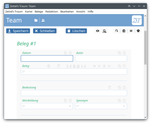
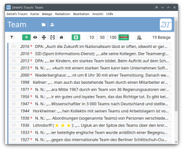

# Zettel’s Traum

*Zettel’s Traum* ist die Wortkartei-App von *Wortgeschichte digital* ([WGd](https://adw-goe.de/forschung/weitere-forschungsprojekte/wortgeschichte-digital-teilprojekt-im-zdl/)), dem an der *Niedersächsischen Akademie der Wissenschaften zu Göttingen* ([NAdWG](https://adw-goe.de/)) angesiedelten Teilprojekt des *Zentrums für digitale Lexikographie der deutschen Sprache* ([ZDL](https://www.zdl.org/)). WGd und das ZDL werden gefördert vom *Bundesministerium für Bildung und Forschung* ([BMBF](https://www.bmbf.de/)).

Die im Projekt *Wortgeschichte digital* mithilfe von *Zettel’s Traum* verfassten Wortgeschichten werden auf der Homepage des ZDL publiziert: <a href="https://wortgeschichten.zdl.org/">wortgeschichten.zdl.org</a>.

<a href="https://adw-goe.de/"></a><a href="https://www.zdl.org/"></a><a href="https://www.bmbf.de/"></a>

## Inhalt
* [Die App](#die-app)
* [Der Name](#der-name)
* [Hilfe](#hilfe)
* [Installation](#installation)
	* [Windows](#windows)
	* [Linux](#linux)
	* [macOS](#macos)
* [Bauanleitung](#bauanleitung)
	* [Kurzfassung](#kurzfassung)
* [Lizenzen](#lizenzen)
* [Kontakt](#kontakt)

## Die App

<a href="img/win/start-karteikarte.png"></a>

*Zettel’s Traum* ist ein Karteikastenprogramm für historisch arbeitende Lexikographen und Lexikographinnen, das für das Wörterbuchprojekt *[Wortgeschichte digital](https://adw-goe.de/forschung/weitere-forschungsprojekte/wortgeschichte-digital-teilprojekt-im-zdl/)* (WGd) geschrieben wurde. Die App entstand aus der Idee heraus, Belegsammlungen auf Karteikarten, wie sie bereits seit den ersten Anfängen des *Deutschen Wörterbuchs von Jacob Grimm und Wilhelm Grimm* im Jahr 1838 in Gebrauch waren, in das digitale Zeitalter zu holen und sie durch eine Vielzahl an Such-, Filter- und Verwaltungsfunktionen zugänglich zu machen. *Zettel’s Traum* soll das Schreiben von Wörterbuchartikeln, bei denen nicht selten mit großen Massen an Textbelegen hantiert wird, komfortabler, das heißt schneller, übersichtlicher, schlicht und ergreifend leichter machen.

<a href="img/win/start-belegliste.png"></a>

Mit *Zettel’s Traum* können Sie Textbelege zu einem Wort (oder einer Wortverbindung) auf virtuelle Karteikarten schreiben, die in Wortkarteien gesammelt und verwaltet werden. Sie können die Belege und Wortkarteien in vielfältiger Weise taggen, also mit weiteren Informationen anreichern und verknüpfen: mit Internetressourcen, mit lokalen Dateien und nicht zuletzt mit Bedeutungen aus einem oder mehreren zentral verwalteten Bedeutungsgerüsten, in denen sich die einzelnen Positionen nach Belieben umbenennen und verschieben, verschmelzen und erweitern lassen, ohne dass man Dutzende oder gar Hunderte Karteikarten einzeln ändern müsste.

Die auf virtuellen Karteikarten gesammelten Belege lassen sich auflisten und in vielfältiger Weise filtern, durchsuchen, markieren, kopieren, duplizieren, auf Wunsch sogar ausdrucken. Die Wortkarteidaten werden dafür in einem ausführlich dokumentierten Klartextformat gespeichert, das auf einem Notationsstandard aufsetzt, der auch in der ferneren Zukunft problemlos von Computerprogrammen zu lesen sein sollte.

Die App ist agnostisch, was die Verwendung eines bestimmten Textkorpus angeht. Sie können Belege aus beliebigen Korpora einpflegen. Allerdings enthält sie spezielle Importfunktionen, die das Erstellen von Karteikarten mit Belegen aus dem *[Deutschen Textarchiv](https://www.deutschestextarchiv.de/)* (DTA), den [Korpora](https://www.dwds.de/r) des *[Digitalen Wörterbuchs der deutschen Sprache](https://www.dwds.de/)* (DWDS) und dem *[Deutschen Referenzkorpus](https://cosmas2.ids-mannheim.de/cosmas2-web/)* (DeReKo) erheblich erleichtern und beschleunigen. Mit nur einem Klick kann die Karteikarte sowohl mit dem Belegtext als auch mit den zugehörigen Metadaten gefüllt werden. Daneben besteht die Möglichkeit, Titeldaten mithilfe einer PPN (unter Nutzung der [unAPI](https://verbundwiki.gbv.de/display/VZG/unAPI)) oder einer Datei im [MODS](https://en.wikipedia.org/wiki/Metadata_Object_Description_Schema)- oder BibTeX-Format zu importieren. BibTeX-Dateien mit Titeldaten werden von *[GoogleBooks](https://books.google.com/)* oder Bibliothekskatalogen wie dem *[Gemeinsamen Verbundkatalog](https://kxp.k10plus.de/DB=2.1/SET=2/TTL=1/)* (GVK) zum Download angeboten.

Neben vielem anderen verfügt die App außerdem über eine Literaturdatenbank und ein XML-Redaktionssystem. Literaturtitel aus der Datenbank, Belegschnitte, Bedeutungsgerüste können mit leicht zu handhabenden Funktionen in der Form eines XML-Snippets (alternativ auch in HTML oder als Klartext) kopiert und in anderen Programmen weiterverwendet werden.

## Der Name

Ein Wort zum Namen, auf den wir das Programm tauften: *Zettel’s Traum* soll natürlich ein lockerer Anklang an das gleichnamige Monumentalwerk Arno Schmidts sein, ein Autor, der nicht nur hier, sondern in seinem gesamten Œuvre zu einer eigenwilligen Orthographie und Interpunktion neigte. Noch im 19. Jh. war die im heutigen Deutschen unübliche (wenn auch nicht in allen Fällen irreguläre) Verwendung des Apostrophs zur Genitivmarkierung bei Eigennamen ganz geläufig. Die damalige Konvention mag eine Quelle Schmidts gewesen sein. In diesem Fall könnte auch eine Rolle gespielt haben, dass *Zettel* (im Original *Bottom*) eine Figur aus Shakespeares *A Midsummer Night’s Dream* ist, wodurch ein Zusammenhang mit der englischen Sprache gegeben ist. (Wobei schon allein der Umstand, dass *Zettel* ein Eigenname ist, für Schmidt Grund genug gewesen sein könnte, ein Apostroph zu verwenden; vgl. seine Trilogie *Nobodaddy’s Kinder* mit dem zweiten Teil *Brand’s Haide*.)

Allzu elaborierte Hintergedanken hatten wir bei der Namensgebung allerdings nicht. Bezüge zu *Zettel’s Traum*, dem Buch, könnte man natürlich in der Monumentalität des Entwurfs sehen, den Wörterbuchprojekte gerne teilen; in der immensen Reichhaltigkeit, mit der über die Seiten des schmidtschen Werks Zitate verschiedenster Autoren verstreut wurden; oder in den rund 120 000 Notizzetteln, auf deren Grundlage Schmidt sein Großwerk verfasste, die ihn vielleicht sogar selbst auf den (ironischen?) Titel brachten.

Da die Figur des *Zettel* im Original des shakespeareschen Dramas *Bottom* heißt: *Zettel’s Traum*, die App, ist natürlich exzellent geeignet, Wörterbuchartikel bottom-up zu verfassen, will sagen induktiv, ausgehend von einer Belegsammlung hin zu den Bedeutungen, ausgehend von einem *Bottom* bzw. *Zettel*.

## Hilfe

Die Benutzung von *Zettel’s Traum* wurde so intuitiv wie möglich gestaltet. Die vielen Fein- und Besonderheiten der App sind in einem ausführlichen Handbuch dokumentiert, in dem sich auch eine knapp gehaltene Kurzanleitung für Ungeduldige findet. Sie erreichen das Handbuch nach dem Programmstart über das Tastaturkürzel F1 oder das Programmmenü: Hilfe > Handbuch.

## Installation

### Windows

Bei jedem [Release](https://github.com/WortgeschichteDigital/ZettelsTraum/releases) haben Sie die Wahl zwischen zwei verschiedenen Downloads:

1. einer portablen Paketierung, die keine Installation erfordert: `zettelstraum_1.0.0_win32_x64.zip`;
2. einem Installer: `zettelstraum_1.0.0_x64.exe`.

Die **Paketierung** enthält einen Ordner namens `zettelstraum-win32-x64`. Entpacken Sie zunächst die ZIP-Datei. Zum Starten der App wechseln Sie in den Ordner und klicken auf die Datei `zettelstraum.exe`.

Für ein Update laden Sie sich einfach die neue Version herunter und ersetzen den Ordner `zettelstraum-win32-x64`. Verpassen Sie ein Update, können Sie immer direkt die neueste Version nehmen.

Der **Installer** legt ein Icon im Windows-Startmenü an, über das das Programm aufgerufen werden kann. Außerdem werden während der Installation automatisch Dateien mit der Endung `.ztj` mit *Zettel’s Traum* verknüpft, sodass sie durch Doppelklick im *Windows-Explorer* geöffnet werden können.

**Unterstützung:** Windows 10 und später mit 64-Bit-Architektur. Das Bauen von 32-Bit-Versionen wäre prinzipiell möglich, dafür müssten Sie aber [selbst aktiv werden](#bauanleitung).

Da die App bisher nicht zertifiziert ist, wird Windows vermutlich das reibungslose Starten des Installers oder Pakets auf Ihrem Rechner unterbinden. Unter Windows 10 könnte die Meldung: „Der Computer wurde durch Windows geschützt“, erscheinen. Klicken Sie in der Meldung auf den Link „Weitere Informationen“, erscheint im Meldungsfenster der Button „Trotzdem ausführen", mit dem Sie die Software installieren bzw. starten können – natürlich nur, wenn Sie uns vertrauen.

### Linux

Für Linux-Nutzer stehen pro [Release](https://github.com/WortgeschichteDigital/ZettelsTraum/releases) ebenfalls zwei verschiedene Downloads zur Verfügung:

1. eine portable Paketierung, die keine Installation erfordert: `zettelstraum_1.0.0_linux_x64.tar.gz`;
2. ein DEB-Paket für Debian, Ubuntu usw.: `zettelstraum_1.0.0_amd64.deb`.

Starten der **Paketierung**:

```
$ tar -xzf zettelstraum_1.0.0_linux_x64.tar.gz
$ cd zettelstraum-linux-x64
$ ./zettelstraum
```

Für ein Update laden Sie sich einfach die neue Version herunter und ersetzen den Ordner `zettelstraum-linux-x64`. Verpassen Sie ein Update, können Sie immer direkt die neueste Version nehmen.

Installieren des **DEB-Pakets**:

```
$ sudo dpkg -i zettelstraum_1.0.0_amd64.deb
```

Die App wird in `/opt/zettelstraum/` abgelegt. Bei der Installation wird die Datei `/usr/share/applications/zettelstraum.desktop` erzeugt, das Programm sollte sich also über das Startmenü Ihrer Distribution aufrufen lassen. Es wird automatisch eine Verknüpfung zwischen der Dateiendung `.ztj` und *Zettel’s Traum* angelegt, sodass Wortkarteien durch Doppelklick im Dateimanager Ihrer Wahl geöffnet werden können.

**Unterstützung:** Distributionen ab Ubuntu 14.04, Fedora 24, Debian 8 mit 64-Bit-Architektur. Die Paketierung erfolgt in einer Distribution, die auf Ubuntu 22.04 basiert. Das Bauen von 32-Bit-Versionen wäre prinzipiell möglich, dafür müssten Sie aber [selbst aktiv werden](#bauanleitung).

### macOS

Für Mac-Nutzer wird mit jedem [Release](https://github.com/WortgeschichteDigital/ZettelsTraum/releases) eine portable **Paketierung** zum Download angeboten: `zettelstraum_1.0.0_darwin_x64.tar.gz`.

Entpacken Sie die Datei durch Doppelklick. Zum Starten wechseln Sie in den Ordner `zettelstraum-darwin-x64` und klicken auf das Icon mit dem Titel „Zettel’s Traum“.

Für ein Update laden Sie sich einfach die neue Version herunter und ersetzen den Ordner `zettelstraum-darwin-x64`. Verpassen Sie ein Update, können Sie immer direkt die neueste Version nehmen.

**Unterstützung:** Version 10.11 (El Capitan) und später mit 64-Bit-Architektur. 32-Bit-Versionen können nicht gebaut werden.

Da die App bisher nicht zertifiziert ist, wird macOS vermutlich das reibungslose Starten der Paketierung auf Ihrem Rechner unterbinden. Erhalten Sie die Meldung, dass *Zettel’s Traum* nicht gestartet werden könne, „da es von einem nicht verifizierten Entwickler stammt“, können Sie die Sicherheitseinstellungen anpassen, um die App dennoch auszuführen. Unter *Systemeinstellungen > Sicherheit > Allgemein* finden Sie den Punkt „App-Download erlauben von“ und darunter den Button „Dennoch öffnen“. Starten Sie die App, nachdem Sie auf „Dennoch öffnen“ geklickt haben, werden Sie zwar noch einmal gefragt, ob Sie das Programm wirklich öffnen möchten, können es mit dem Button „Öffnen“ aber problemlos starten.

## Bauanleitung

Bei *Zettel’s Traum* handelt es sich um eine [Electron](https://electronjs.org/)-App. Die Funktionsweise des Frameworks wird in einer technischen Dokumentation zusammenfassend erläutert. Das Dokument können Sie nach dem Start der App über das Programmmenü aufrufen: Hilfe > Technische Dokumentation. Im Kapitel *Framework* finden Sie (hoffentlich) alles Wissenswerte zum Starten und Paketieren.

### Kurzfassung

Repository klonen:

```
$ git clone https://github.com/WortgeschichteDigital/ZettelsTraum.git zettelstraum
```

Oder den Tarball herunterladen, in dem sich mit jedem neuen [Release](https://github.com/WortgeschichteDigital/ZettelsTraum/releases) ein Snapshot des Quellcodes findet: `zettelstraum_1.0.0.tar.gz`.

```
$ tar -xzf zettelstraum_1.0.0.tar.gz
```

Node.js installieren:

```
$ sudo apt-get install nodejs
```

Electron installieren:

```
$ cd zettelstraum_1.0.0
$ npm install --save-dev electron
```

Starten der App:

```
$ npm start
```

Electron-Packager installieren:

```
$ npm install --save-dev electron-packager
```

Paketieren:

```
$ node installer/packager.js [win32|linux|darwin]
```

## Lizenzen

Alle Eigenentwicklungen von *Zettel’s Traum* stehen unter der [GNU General Public License v3.0](https://www.gnu.org/licenses/gpl-3.0.en.html).

Die Icons stammen zum größten Teil aus dem *[Papirus Icon Theme](https://github.com/PapirusDevelopmentTeam/papirus-icon-theme)*, das ebenfals unter [GNU General Public License v3.0](https://www.gnu.org/licenses/gpl-3.0.en.html) lizenziert wurde. Die Original-Icons wurden alle leicht verändert. Daneben gibt es eigens für *Zettel’s Traum* erstellte Icons, die unter derselben Lizenz stehen. Welche der Grafiken aus dem *Papirus Theme* stammen und welche neu erstellt wurden, lässt sich im Einzelnen den Metadaten der SVG-Dateien entnehmen. Einige neu erstellte Grafiken basieren mitunter auf Teilen von *Papirus*-Icons.

Die mitgelieferten *[Noto Fonts](https://www.google.com/get/noto/)* stehen unter einer [SIL Open Font License v1.1](https://scripts.sil.org/cms/scripts/page.php?id=OFL).

## Kontakt

[Nico Dorn](https://adw-goe.de/forschung/weitere-forschungsprojekte/wortgeschichte-digital-teilprojekt-im-zdl/mitarbeiterinnen-und-mitarbeiter/nico-dorn/), Niedersächsische Akademie der Wissenschaften zu Göttingen
